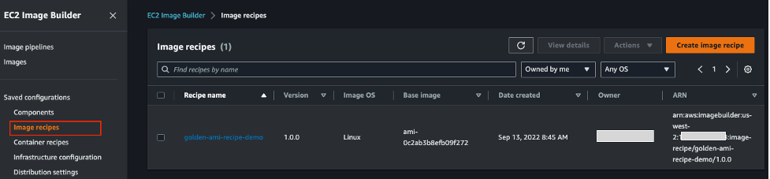
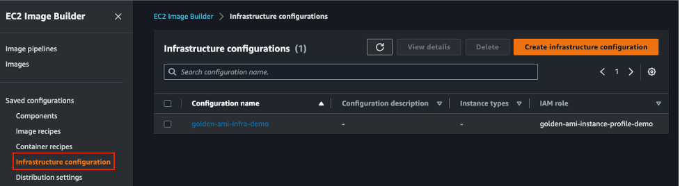
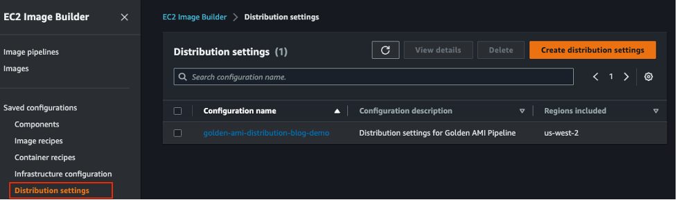
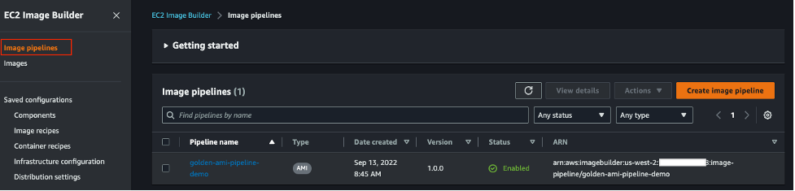
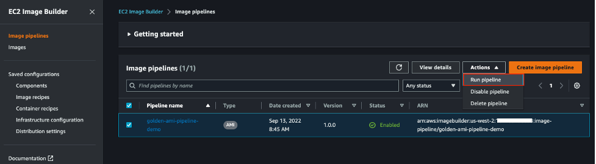
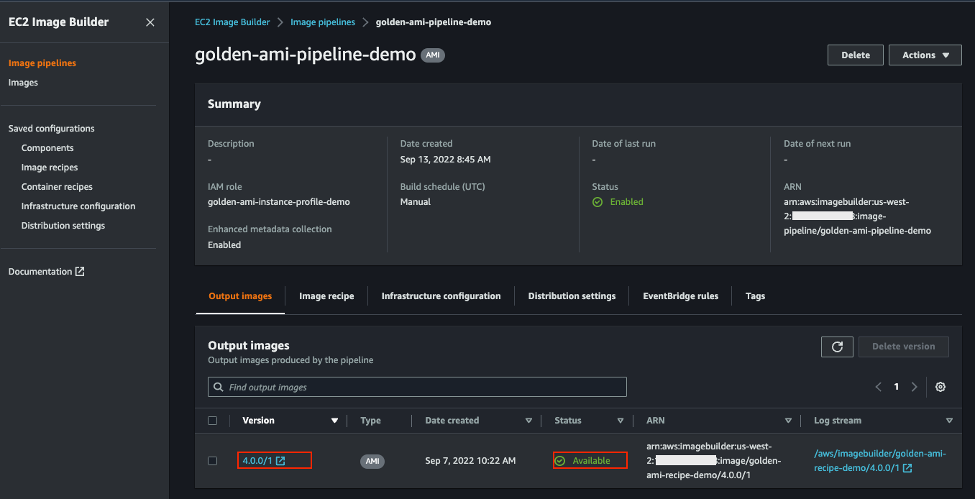

<!-- vscode-markdown-toc -->
# Table of Contents
- [**Overview**](#overview)
- [**Solution**](#solution)
- [**Target Architecture**](#arch)
- [**Key Features**](#keyfeatures)
- [**Limitations**](#limitations)
- [**Pre Requisite**](#prereq)
- [**How to Deploy**](#howtodeploy)
- [**Verification**](#verification)
- [**Run Image pipeline**](#pipeline)
- [**Parameter Details**](#parameterdetails)
- [**Clean Up**](#cleanup)
- [**Conclusion**](#conclusion)

# <a name='overview'></a>Overview
Golden Amazon Machine Image (AMI) pipeline enables creation, distribution, verification, launch-compliance of the AMI and creates a continuous and repeatable process for the consumers to generate the golden AMI. Currently when a user wants to build, test and distribute a Golden AMI across multiple accounts/regions, user will have to create multiple resources including image recipes, build and test steps, infrastructure creation and distribution step and connect them together in image pipeline using EC2 Image Builder service. User needs to define each stage and resources required for each stage of the image builder pipeline which is a lengthy process

In this solution, we will be using EC2 Image Builder service for the heavy lifting work of building, testing and distributing the Golden AMI. The code repository contains all the configuration files provided the user. These configuration files will define how the AMI will be built, tested and distributed across multiple accounts/regions. AWS Cloud Development Kit (AWS CDK) application will read configuration file ( the details of the configuration file provided by user is described in Configuration File section) and deploy the necessary resources to create AMI Pipeline.

# <a name='solution'></a>Solution
Amazon Machine Image (AMI) provides the information required to launch an Elastic Compute Cloud (Amazon EC2) instance, which is a virtual server in the AWS Cloud. A golden AMI is an AMI that contains the latest security patches, software, configuration, and software agents that you need to install for logging, security maintenance, and performance monitoring.
In this solution, we will provide users a way to deploy Golden AMI Pipeline using AWS CDK as Infrastructure as Code that will be driven by user configuration. User will be able to provide all configuration information including build, test, distribution that can be used by the AWS CDK application to create and customize the Golden AMI Pipeline. The solution will ensure that the Security best practice is also integrated for AMI Image encryption and distribution. On a **high** level, the image builder pipeline consists of the following -

- Recipe
    -   What Base Image to Use
    -   What are the Build steps
    -   What are the Test and validate steps
- Infrastructure
    -   What type of EC2 instance to launch, build, test
    -   Which VPC, Subnet and Security Group to use while launching the instance.
- Distribution
    -   Where to Distribute the AMI after creation - which account/region
    -   What tag will be added in the AMI in the target account 


# <a name='arch'></a>Target Architecture


# <a name='keyfeatures'></a>Key Features 
-   As part of the security best practice, there will be one Customer Managed Key (CMK) created per pipeline and the underlying Amazon Elastic Block Store (Amazon EBS) volume of AMI will be encrypted with the same. This can be turned on/off with parameters which is described later.

-   Base image can refer to AWS managed public Parameter Store, a capability of AWS Systems Manager (for example - /aws/service/eks/optimized-ami/1.14/amazon-linux-2/recommended) that holds the latest Amazon Linux 2 AMI or latest Amazon Elastic Kubernetes Service (Amazon EKS) optimized AMI or it can refer any Base AMI ID (ami-0123456789) that is available in the region where the service is being deployed

-   User can bring their own Build and Test steps ( in yaml file) or AWS managed pre-build Systems Manager documentation can also be used.

-   Image Pipeline will send Amazon SNS (Amazon Simple Notification) notification for success or failure.

-   AMI Pipeline creation is configuration driven. AWS CDK application will read the user provided configuration and provision the pipeline. 


# <a name='limitations'></a>Limitations
- An EC2 Image Builder recipe defines the base image to use as your starting point to create a new image, along with the set of components that you add to customize your image and verify that everything is working as expected. A maximum of 20 components, which include build and test, can be applied to a recipe. After you create an image recipe you cannot modify or replace the recipe. To update components after a recipe is created, you must create a new recipe or recipe version. Pease check the parameter details section [here](#parameterdetails) on how to provide the recipe version. Any changes to base image, components ( ad/delete/update/re-order) requires a new recipe or recipe version. More information on recipe can be found [here](https://docs.aws.amazon.com/imagebuilder/latest/userguide/manage-recipes.html)
- Updating to any existing component requires a new version to be created. Pease check the parameter details section [here](#parameterdetails) on how to provide the component version

# <a name='prereq'></a>Pre-Requisite

-   Ensure you have a Git client installed following [these](https://git-scm.com/downloads) instruction
-   Set up AWS Credentials in your environment using [these](https://docs.aws.amazon.com/sdk-for-java/v1/developer-guide/setup-credentials.html) instruction
-   Ensure you have [Node](https://nodejs.org/en/download/) installed
-   An active AWS account
-   A web browser that is supported for use with the AWS Management Console. (See the [list](https://aws.amazon.com/premiumsupport/knowledge-center/browsers-management-console/) of supported browsers)
-   AWS CDK (version2 )  CLI. Refer [link](https://docs.aws.amazon.com/cdk/v2/guide/getting_started.html) on how to install

To configure cross-account distribution permissions in AWS Identity and Access Management (IAM), follow these steps:

1. To use Image Builder AMIs that are distributed across accounts, the destination account owner must create a new IAM role in their account called ```EC2ImageBuilderDistributionCrossAccountRole```.

2. They must attach the ```Ec2ImageBuilderCrossAccountDistributionAccess``` policy to the role to enable cross-account distribution.

3. Verify that the source account ID is added to the trust policy attached to the IAM role of the destination account. Example - 
```
{
    "Version": "2012-10-17",
    "Statement": [
        {
            "Effect": "Allow",
            "Principal": {
                "AWS": [
                    "arn:aws:iam::<SOURCE_AWS_ACCOUNT_ID>:root"
                ]
            },
            "Action": "sts:AssumeRole"
        }
    ]
}
```
4. If the AMI you distribute is encrypted, the destination account owner must add the following inline policy to the ```EC2ImageBuilderDistributionCrossAccountRole``` in their account so that they can use your KMS keys. The Principal section contains their account number. This enables Image Builder to act on their behalf when it uses AWS KMS to encrypt and decrypt the AMI with the appropriate keys for each Region.

:pushpin: set ```iamEncryption``` parameter in ```bin/config.json``` file to enable/disable encryption. More information can be found [here](#parameterdetails)
```

{
    "Version": "2012-10-17",
    "Statement": [
        {
            "Action": [
                "kms:CreateGrant",
                "kms:Decrypt",
                "kms:DescribeKey",
                "kms:Encrypt",
                "kms:Generate*",
                "kms:ListGrants",
                "kms:ReEncrypt*"
            ],
            "Resource": "*",
            "Effect": "Allow"
        },
        {
            "Action": "ec2:CreateTags",
            "Resource": "arn:aws:ec2:*::snapshot/*",
            "Effect": "Allow"
        }
    ]
}
```

For more information on setting up cross-account AMI distribution, visit [Page](https://docs.aws.amazon.com/imagebuilder/latest/userguide/cross-account-dist.html#cross-account-prereqs-iam)


# <a name='howtodeploy'></a>How to Deploy

1.   Clone the Repo and navigate to the folder

        `git clone https://github.com/aws-samples/aws-cdk-golden-ami-pipeline.git`

        `cd cdk-golden-ami-pipeline`

2. Provide the props `ami_config` (which is type of `MainConfig`) inside the class name `createImageBuilder` located in the file `bin/cdk.ts`
   For sample props, refer to  `example_props` folder and the parameter details are described [**here**](#parameterdetails).


3. set the region where the stack will be deployed. For example

    ``export CDK_DEPLOY_REGION=us-west-2``

4. Install required packages

    ```npm install```

5. Deploy the CDK application

    ```cdk deploy ```

# <a name='verification'></a>Verification
Once the CDK application is deployed successfully , navigate to Image Builder Service to verify and check all the following resources created

Recipe
    
Components
    
Infrastructure
    
Distribution
    
Image Pipelines
    

# <a name='pipeline'></a>Run the Image Pipeline
After you deploy the solution, all you have to do is to navigate to Image Builder Service Console, select the Image Pipeline and start the pipeline by clicking ‘Run Pipeline’ button in the upper right corner and your golden AMI is ready for distribution. 



Once the status of the Pipeline execution status is available, click version link to get all the AMI ids ( along with the distributed AMI is different region/account)




In less than few minutes, you've created and deployed a new golden image pipeline that you can continue to iterate on in the future and leverage for additional image pipelines as your business grows

> If you setup distribution([Settings](https://github.com/aws-samples/aws-cdk-golden-ami-pipeline#distribution) in the bin/config.json file), the image should be available in the target account/region. Please check EC2 AMI section from AWS Console.


# <a name='parameterdetails'></a>Parameter Details

`MainConfig` interface contains the following parameters ("?" represents optional parameters)- 

```
baseImage: ec2.IMachineImage
amiComponentBucketName?: s3.IBucket;
amiComponentBucketCreate?: boolean;
amiComponentBucketVersion?: boolean;
imagePipelineName?: string;
instanceProfileName?: string;
instanceProfileRoleName?: string;
iamEncryption?: boolean;
componentsPrefix: string;
keyAlias?: string;
imageRecipe: Recipe;
snsTopic?: sns.ITopic
attribute?: string;
amitag?: Tags;
tag?: Tags;
schedule?: object;
infrastructure?: infrastructure;
componentConfig: ComponentConfig;
Distribution?: distribution[];
distributionName?: string;
distributionDescription?: string;
resourceRemovalPolicy?: cdk.RemovalPolicy;
defaultComponentConfig?: ComponentConfig
```

| Parameter Name | Required | Type | example | Default Value | Notes |
| :--------------- |:---------------|:---------------|:---------------|:---------------|:---------------|
| attribute | Yes | String | `demo` | NA | Meaningful String that uniquely identifies the pipeline. This attribute will be appended to deployed resource name if not provided |
|baseImage|Yes|ec2.IMachineImage|[MachineImage](https://docs.aws.amazon.com/cdk/api/v2/docs/aws-cdk-lib.aws_ec2.MachineImage.html)|NA| baseImage  refer to base AMI ID. Golden AMI will be created based off this base image. **baseImage** AMI id MUST be available in the account/region you are deploying the pipeline to|
|resourceRemovalPolicy|No|String | `destroy` or `retain` |`retain`|Image Builder component and recipe removal policy. Based on this, the older version of image builder component and recipe will either be deleted or retained.|
|amiComponentBucketName|No|String|`golden-ami-bucket-20220911`|CDK application will create a dynamic name|This bucket will contain all the related user defined build and test component. If not specified, CDK application will create a new bucket with autogenerated name|
|amiComponentBucketCreate|No|Boolean|`true` or `false` | `true`|If true, a new S3 bucket will be created. If false, then `amiComponentBucketName` must be provided and bucket must exist|
|amiComponentBucketVersion|No|Boolean|`true` or `false`|`true`|The parameter is used to enable/disable S3 Bucket version
|instanceProfileName|No|String|`golden-ami-instance-profile-demo`|`golden-ami-instance-profile-${attribute}`| Instance Profile that will be attached with the EC2 instance
|instanceProfileRoleName|No|String|`golden-ami-instance-profile-role-demo`|CDK application will create a autogenerated name|This role will be attached to the EC2 instance Profile|
|imagePipelineName|No|String|`golden-ami-pipeline-demo`|`golden-ami-pipeline-${attribute}`|The Name of the Image pipeline to be created.|
|componentsPrefix|Yes|String|`components`|NA|prefix of the S3 Bucket `amiComponentBucketName` where the related component files will be uploaded and referenced|
|iamEncryption|No|Boolean|`true` or `false`|`false`|If enabled, a new CMK key will be created and underlying EBS volume of the AMI will be encrypted with the same|
|amitag|No|object|[**example**](#amitag)|NA|This tag will be applied to the distributed AMI in target account/region|
|tag|No|object|[**example**](#tag)|NA|This tag will be applied to all the resources created by the CDK application|
|imageRecipe|Yes|[**recipe**](#imageRecipe)|[**example**](#recipe)|NA|EC2 Builder image recipe|
|infrastructure|yes|[**infrastructure**](#infrastructure)|[**example**](#infrastructure)|Ec2 Builder Infrastructure details that will be used to launch EC2 instance|
|componentConfig|Yes|[**ComponentConfig**](#ComponentConfig)|[**example**](#ComponentConfig)|NA|Defines the Build and Test Steps|
|Distribution|No|list of [**distribution**](#distribution)|[**example**](#distribution)|NA|The config detail about which target account and region the golden AMI will be distributed|
|distributionName|No|String|`golden-ami-distribution-demo`|`golden-ami-distribution-${attribute}`|Distribution settings name|
|distributionDescription|No|String|`Distribution settings for demo`|`Distribution settings for ${attribute}`|Description of the distribution settings
|snsTopic|No|String|`arn:aws:sns:us-east-1:111122223333:myTopic`|NA|Notification will be sent to this SNS Topic, after Image builder pipeline execution is completed.|
|keyAlias|No|String|`golden-ami-cmk-key`|NA|If not provided, KMS key will be created without alias name
|defaultComponentConfig|No|[**ComponentConfig**](#ComponentConfig)|[**example**](#defaultComponentConfig)|NA|Optional parameter that contains Build and Test step that can be added by default. The Build Steps added in this parameter will be executed at first. The Test steps added in this parameter will be executed last. This is one way to enforce mandatory build and test step. For example, This parameter can contain mandatory build step such as upgrading all available OS Package and mandatory test step to check if reboot is working after all build is completed. 
|schedule|No|`{ "PipelineExecutionStartCondition" : String, "ScheduleExpression" : String }` . For more information, [link](https://docs.aws.amazon.com/AWSCloudFormation/latest/UserGuide/aws-properties-imagebuilder-imagepipeline-schedule.html)|{ "scheduleExpression": "cron(0 10 * * ? *)"}|`Manual`|AMI Pipeline Schedule|


##  :large_blue_circle: <a name='distribution'></a> **distribution**

### Type
```
{
  region: string;
  accounts: string[];
}
```
### Details

| Parameter Name | Required | Type | example | Default Value | Notes |
| :--------------- |:---------------|:---------------|:---------------|:---------------|:---------------|
|region|Yes|String|us-west-2|NA|Region name where Golden AMI will be distributed
|accounts|Yes|List of String|["1234556789","987654321"]|NA|Account Name where Golden AMI will be distributed


### Example
```
[
    {
        "region": "us-east-1",
        "accounts": [
            "111122223333",
            "444455556666"
        ]
    }
]
```

## :large_blue_circle: <a name='infrastructure'></a> **infrastructure**

### Type
```
{
        name?: string;
        instanceType?: ec2.InstanceType[];
        subnetId?: ec2.ISubnet;
        securityGroups?: ec2.ISecurityGroup[];
}
```

### Details

| Parameter Name | Required | Type | example | Default Value | Notes |
| :--------------- |:---------------|:---------------|:---------------|:---------------|:---------------|
|name|No|String|`golden-ami-infra-demo`|`golden-ami-infra-${attribute}`|Name of the infrastructure resource created in Image builder service.
|instanceType|No|List of ec2.InstanceType|`["t2.small"]`|m5.large|Instance type to be used for Building Golden AMI
|subnetId|No|ec2.ISubnet|`subnet-0caeab2cb8575df26`|Default VPC in the account/region|If not provided, default VPC should exist
|securityGroups|No|ec2.ISecurityGroup|`["sg-077b2c5e060e46f50"]`|Default Security Group|This is needed if the subnet ID is provided.


### Example 
```
{
    "name": "golden-ami-infra-demo",
    "instanceType": [
        "t2.small"
    ],
    "subnetId": "subnet-0caeab2cb8575df26",
    "securityGroups": [
        "sg-077b2c5e060e46f50"
    ]
}
```


## :large_blue_circle: <a name='ComponentConfig'></a> **componentConfig**

### Type
```

{
    Build?: {
      name?: string;
      file?: string;
      version?: string;
      arn?: string;
      parameter?: { name: string; value: string[]
        }[];
    }[];
    Test?: {
      name?: string;
      file?: string;
      version?: string;
      arn?: string;
      parameter?: { name: string; value: string[]
        }[];
    }[];
}
```

### Details

| Parameter Name | Required | Type | example | Default Value | Notes |
| :--------------- |:---------------|:---------------|:---------------|:---------------|:---------------|
|name|Yes|String|Install_jq|NA|name of the Build/Test component. If **arn** is used, then this parameter is not required.
|file|Yes|String|components/build1.yaml|NA|user provided component yaml file path. If **arn** is used, then this parameter is not required
|version|Yes|String|1.0.0|NA|semantic version of the component to be created. If **arn** is used, then this parameter is not required
|arn|No|String|arn:aws:imagebuilder:us-east-1:aws:component/update-linux/1.0.2/1|NA|amazon managed component arn. Make sure this exists in the account/region the pipeline is being used. Navigate to image builder console ->component->select amazon owned).Also, if arn is provided, then name, file, version parameter is not required. Check the below example|
|parameter|No|List of [**Component Parameter**](#parameter)|[**example**](#parameter)|NA|parameter is needed if the component is created with non default parameter

### Example

```
{
    "Build": [
        {
            "name": "build1",
            "file": "components/build1.yaml",
            "version": "1.0.1",
            "parameter": [
                {
                    "name": "testparam",
                    "value": [
                        "samplevalue"
                    ]
                }
            ]
        },
        {
            "arn": "arn:aws:imagebuilder:us-east-1:aws:component/update-linux/1.0.2/1"
        },
        {
            "name": "build2",
            "file": "components/build2.yaml",
            "version": "1.0.1"
        }
    ],
    "Test": [
        {
            "name": "test2",
            "file": "components/test1.yaml",
            "version": "1.0.1"
        },
        {
            "arn": "arn:aws:imagebuilder:us-east-1:aws:component/reboot-test-linux/1.0.0/1"
        }
    ]
}
```
>:warning: **componentConfig** contains one or more Build/Test components. Each Build or Test may contain some parameter as given below - 
Any changes in Component content , requires a new version to be created. All the Components immutable with a specific version. If you change the content of any component , update the version as well. Otherwise, component creation will fail. 

## :large_blue_circle: <a name='defaultComponentConfig'></a> **defaultComponentConfig**

```
	"defaultComponentConfig" : {
		"Build": [
		  {
			"arn": "arn:aws:imagebuilder:us-east-1:aws:component/update-linux/1.0.2/1"
		  }
		],
		"Test": [
		  {
			"arn": "arn:aws:imagebuilder:us-east-1:aws:component/reboot-test-linux/1.0.0/1"
		  }
		]
	  }
```

## :large_blue_circle: <a name='imageRecipe'></a> **imageRecipe**

### Type

```
{
    imageRecipeVersion: string; 
    imageRecipeName?: string ; 
    volumeSize?: number;
    volumeType?: string;
    deleteOnTermination?: boolean
}
```
> :warning: **Image Recipe** is immutable with a specific version. Recipe contains all the components with specific version in a specific order. If the component version changes, or new components added, or components order has been modified, please make sure to update the recipe version. 

### Details

| Parameter Name | Required | Type | example | Default Value | Notes |
| :--------------- |:---------------|:---------------|:---------------|:---------------|:---------------|
|imageRecipeName|No|String|golden-ami-recipe-demo|golden-ami-recipe-${attribute}|Image Recipe Name to be created
|imageRecipeVersion|Yes|String|1.0.0|NA|Semantic version of the component
|volumeSize|No|Number|2048|8192|EBS volume size of the EC2 instance|EBS Volume type of the EC2 instance
|volumeType|No|String|gp2|NA|
|deleteOnTermination|No|Boolean|false|if true, the underlying EBS volume will be deleted after AMI is created.

### Example

```
{
	"imageRecipeVersion": "3.1.6",
	"imageRecipeName": "golden-ami-recipe-demo",
	"volumeSize": 3072,
	"deleteOnTermination": false,
	"volumeType": "gp2"
}
```


## :large_blue_circle: <a name='amitag'></a> **amitag**


### Example


```
{
	"env": "dev",
	"Name": "golden-ami-dev-{{imagebuilder:buildDate}}",
	"Date_Created": "{{imagebuilder:buildDate}}",
}
``` 


## :large_blue_circle: <a name='tag'></a> **tag**

### Example
```
{
	"env": "dev",
	"Name": "golden-ami-demo-dev"
}
```


## :large_blue_circle: <a name='parameter'></a> **Component parameter**

### Example

```
[
    {
        "name": "param1",
        "value": [
            "value1"
        ]
    },
    {
        "name": "param2",
        "value": [
            "value2"
        ]
    }
]
```

# <a name='cleanup'></a> Clean up

- set the region where the stack is deployed. For example

    ``export CDK_DEPLOY_REGION=us-west-2``

- Destroy the CDK application

    ```cdk destroy```

# <a name='conclusion'></a>Conclusion

In today’s world, organizations need to be agile and be able to scale their applications based on
the demand. Applications need operating systems to run and operating systems need to have
tools and third party apps installed on them and properly patched on a regular basis. Maintaining
and managing organization-wide operating systems at scale can be a challenging task for the
operation teams. Manually setting up servers just doesn’t scale. With this solution, customers can
build, test, and deploy custom-built, secure AMIs for their organization and distribute them in a
multi-account environment.

### Contributors
 - Sandip Gangapadhyay
 - Siamak Heshmati
 - Viyoma Sachdeva


