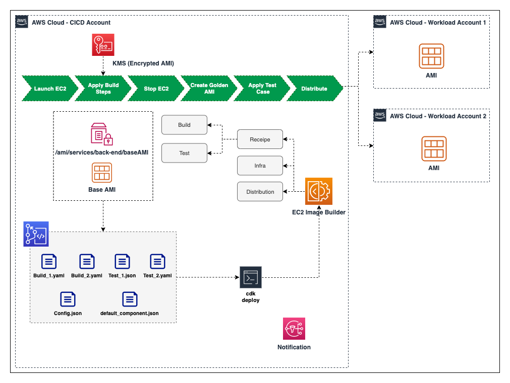

<!-- vscode-markdown-toc -->
# Table of Contents
- [**Background**](#Background)
- [**Solution**](#keyfeatures)
- [**Target Architecture**](#Background)
- [**Key Features**](#keyfeatures)
- [**Pre Requisite**](#prereq)
- [**How to Deploy**](#howtodeploy)
- [**Parameter Details**](#ParameterDetails)
- [**Conclusion**](#conclusion)
- [**Clean Up**](#cleanup)

# Background
AMIs provide the information required to launch an Amazon EC2 instance, which is a virtual server in the AWS Cloud. A golden AMI is *an AMI that contains the latest security patches, software, configuration, and software agents that you need to install for logging, security maintenance, and performance monitoring. 
*

The golden AMI pipeline enables creation, distribution, verification, launch-compliance of the AMI and create a continuous and repeatable process for the consumers to generate the golden AMI. Currently when a user wants to build, test and distribute a Golden AMI across multiple accounts/regions, user will have to create multiple resources including image recipies, build and test steps, infrastructure creation and distribution step and connect them together in image pipeline using Ec2 image builder service. User needs to define each stage and resources required for each stage of the imge builder pipeline which is a lengthy process 


# Solution
In this solution, we will be using AWS EC2 Image Builder service for the heavy lifting work of Building, testing and Distributing the Golden AMI. 
The code repository contains all the configuration files provided the user. These configuration files will define how the AMI will be built, tested and distributed across multiple account/region. CDK application will read configuration file ( the details of the configuration file provided by user is described in Configuration File section) and deploy the necessary resources to create AMI Pipeline. 

In this blog, we will provide users a way to deploy Golden AMI Pipeline using CDK as Infrastructure as Code that will be driven by user configuration. User will be able to provide all configuration information including build, test, distribution that can be used by the CDK application to create and customize the Golden AMI Pipeline. The solution will ensure that the Security best practice is also integrated for AMI Image encryption and distribution. 
On a **high level**, the image builder pipeline consists of the following - 

- Recipe
    -   What Base Image to Use
    -   What are the Build steps
    -   What are the Test and validate steps
- Infrastructure
    -   What type of EC2 instance to launch, build, test
    -   Which VPC, Subnet and Security Group to use while launching the instance.
- Distribution
    -   Where to Distribute the AMI after creation - which account/region
    -   What tag will be added in the AMI in the target account 


# Target Architecture



# <a name='keyfeatures'></a>Key Features 
-   As part of the security best practice, there will be one Customer Managed Key ( CMK) created per pipeline and the underlying EBS volume of AMI will be encrypted with the same. This can be turned on/off with parameters which is described later. 

-   Base image can refer to AWS managed public ssm parameter (for example - /aws/service/eks/optimized-ami/1.14/amazon-linux-2/recommended) that holds the latest Amazon Linux 2 AMI or latest EKS optimized AMI or it can refer any Base AMI ID (ami-0123456789) that is available in the region where the service is being deployed

-   User can bring their own Build and Test steps ( in yaml file) or AWS managed pre-build SSM documentation can also be used.

-   Image Pipeline will send SNS notification for success or failure. 

-   AMI Pipeline creation is configuration driven. CDK application will read the user provided configuration and provision the pipeline. 


# <a name='prereq'></a>Pre-Requisite

-   Ensure you have a Git client installed following [these](https://git-scm.com/downloads)
-   Set up AWS Credentials in your environment using [these](https://docs.aws.amazon.com/sdk-for-java/v1/developer-guide/setup-credentials.html)
-   Ensure you have Node [Node](https://nodejs.org/en/download/) installed

To configure cross-account distribution permissions in AWS Identity and Access Management (IAM), follow these steps:

1. To use Image Builder AMIs that are distributed across accounts, the destination account owner must create a new IAM role in their account called ```EC2ImageBuilderDistributionCrossAccountRole```.

2. They must attach the ```Ec2ImageBuilderCrossAccountDistributionAccess``` policy to the role to enable cross-account distribution.

3. Verify that the source account ID is added to the trust policy attached to the IAM role of the destination account. Example - 
```
{
    "Version": "2012-10-17",
    "Statement": [
        {
            "Effect": "Allow",
            "Principal": {
                "AWS": [
                    "arn:aws:iam::<SOURCE_AWS_ACCOUNT_ID>:root"
                ]
            },
            "Action": "sts:AssumeRole"
        }
    ]
}
```
4. If the AMI you distribute is encrypted, the destination account owner must add the following inline policy to the ```EC2ImageBuilderDistributionCrossAccountRole``` in their account so that they can use your KMS keys. The Principal section contains their account number. This enables Image Builder to act on their behalf when it uses AWS KMS to encrypt and decrypt the AMI with the appropriate keys for each Region.

:pushpin: set ```iamEncryption``` paramter in ```bin/config.json``` file to enable/disable encryption. More information can be found [here](#ParameterDetails)
```

{
    "Version": "2012-10-17",
    "Statement": [
        {
            "Action": [
                "kms:CreateGrant",
                "kms:Decrypt",
                "kms:DescribeKey",
                "kms:Encrypt",
                "kms:Generate*",
                "kms:ListGrants",
                "kms:ReEncrypt*"
            ],
            "Resource": "*",
            "Effect": "Allow"
        },
        {
            "Action": "ec2:CreateTags",
            "Resource": "arn:aws:ec2:*::snapshot/*",
            "Effect": "Allow"
        }
    ]
}
```

For more information on setting up cross-account AMI distribution, visit [Page](https://docs.aws.amazon.com/imagebuilder/latest/userguide/cross-account-dist.html#cross-account-prereqs-iam)


# <a name='howtodeploy'></a>How to Deploy

-   Clone the Repo and navigate to the folder

    ```git clone https://gitlab.aws.dev/gangapad/cdk-golden-ami-pipeline.git```

    ```cd cdk-golden-ami-pipeline```
- Update Config files. There are two config files - 

    `bin/config.json` - Configuration file that defines all the parameters needed to deploy the AMI Pipeline. For the details for all the parameters in thsi file, check [**here**](#ParameterDetails).
    

    Two additional sample ```config.json``` file has been provided. you can use content from these files based on your requirement. 
        -   bin/basic_config.json --> This contains minimum paramter ( those are required ) to deploy the solution
        -   bin/detailed_config.json --> this contains all the paremeters supported in this implementation

    > Please note that you need to copy your desried configuration to `bin/config.json` file

    `bin/default_component.json` - Optional component file that contains Build and Test step that can be added by default. The Build Steps added in this file will be executed at first. The Test steps added in this file will be executed last. This is one way to enforce mandatory build and test step. For example, This file can contain mandatory build step such as upgrading all available OS Package and mandatory test step to check if reboot is working after all build is completed. Type of this value is ComponentConfig which is described below. In this example we used two Amazon-managed component.
    if you do not want to use any default component file, replace the following line

    ```
    const Golden_AMI_Pipeline = new ImagebuilderPipeline(this, "ImagebuilderPipeline", {
      user_config: ami_config,
      default_component: default_component
    });
    ```
    with
    ```
    const Golden_AMI_Pipeline = new ImagebuilderPipeline(this, "ImagebuilderPipeline", {
      user_config: ami_config
    });
    ```

- set the region where the stack will be deployed. For example

    ``export CDK_DEPLOY_REGION=us-west-2``

- set the **baseImage** value in ```bin/config.json``` file. This MUST be available in the account/region you are deploying the pipeline. For example, 

   ```"baseImage": "ami-0c2ab3b8efb09f272"```

- Install required packages

    ```npm install```

- Deploy the CDK application

    ```cdk deploy ```

-   Once the CDK application is deployed successfully , navigate to Image Builder Service to verify and check all the following resources created

    * Recipe
    * Components
    * Infrastructure
    * Distribution
    * Image Pipelines


- Run the Image Pipeline. Navigate to Image Builder Service Console, select the Image Pipeline and start the pipeline by clicking ‘Run Pipeline’ button in the upper right corner. 
The status of the pipeline will change through different phase . 

    > Building :arrow_right:  Testing :arrow_right:  Distributing :arrow_right: Integrating :arrow_right: Available

    Once the status of the Pipeline execution status is available, click version link to get all the AMI ids ( along with the distributed AMI is different region/account)

    > If you setup distribution, the image should be available in the traget account/region. Please check EC2 AMI section from AWS Console.


# <a name='ParameterDetails'></a>Parameter Details

`config.json` file contains the following parameters ("?" represensts optional paramter)- 

```
baseImage: string;
baseImageType?: string;
ami_component_bucket_name?: string;
ami_component_bucket_create?: boolean;
ami_component_bucket_version?: boolean;
imagePipelineName?: string;
instanceProfileName?: string;
instanceProfileRoleName?: string;
iamEncryption?: boolean;
components_prefix: string;
key_alias?: string;
image_recipe: Recipe;
sns_topic?: string;
attr?: string
amitag?: object;
tag?: object;
schedule?: object;
infrastructure?: infrastructure;
Component_Config: ComponentConfig;
Distribution?: distribution[];
distributionName?: string;
distributionDescription?: string;
resource_removal_policy?: string
```

| Parameter Name | Required | Type | example | Default Value | Notes |
| :--------------- |:---------------|:---------------|:---------------|:---------------|:---------------|
| attr | Yes | String | `demo` | NA | Meaningful String that uniquely identifies the pipeline. This attribute will be appended to deployed resource name if not provided |
|baseImage|Yes|String|`ami-090fa75af13c156b4` or `/golden/ami`|NA| baseImage  refer to base AMI ID or SSM parameter that contains AMI ID. Golden AMI will be created based off this base image. **baseImage** AMI id MUST be available in the account/region you are deploying the pipeline to|
|baseImageType| No| String | `ssm` or `id` | `id` | select `ssm`, if baseImage contains SSM Parameter, Select `id` if baseImage contains AMI ID
|resource_removal_policy|No|String | `destroy` or `retain` |`retain`|Image Builder component and recipe removal policy. Based on this, the older version of image builder component and recipe will either be deleted or retained.|
|ami_component_bucket_name|No|String|`golden-ami-bucket-20220911`|CDK application will create a dynamic name|This bucket will contain all the related user defined build and test component. If not specified, CDK application will create a new bucket with autogenerated name|
|ami_component_bucket_create|No|Boolean|`true` or `false` | `true`|If true, a new S3 bucket will be created. If false, then `ami_component_bucket_name` must be provided and bucket must exist|
|ami_component_bucket_version|No|Boolean|`true` or `false`|`true`|The parameter is used to enable/disable S3 Bucket version
|instanceProfileName|No|String|`golden-ami-instance-profile-demo`|`golden-ami-instance-profile-${attr}`| Instance Profile that will be attached with the EC2 instance
|instanceProfileRoleName|No|String|`golden-ami-instance-profile-role-demo`|CDK application will create a autogenerated name|This role will be attached to the EC2 instance Profile|
|imagePipelineName|No|String|`golden-ami-pipeline-demo`|`golden-ami-pipeline-${attr}`|The Name of the Image pipeline to be created.|
|components_prefix|Yes|String|`components`|NA|prefix of the S3 Bucket `ami_component_bucket_name` where the related component files will be uploaded and referenced|
|iamEncryption|No|Boolean|`true` or `false`|`false`|If enabled, a new CMK key will be created and underlying EBS volume of the AMI will be encrypted with the same|
|amitag|No|object|[**example**](#amitag)|NA|This tag will be appplied to the distributed AMI in target account/region|
|tag|No|object|[**example**](#tag)|NA|This tag will be applied to all the resources created by the CDK application|
|image_receipe|Yes|recipe|[**example**](#recipe)|NA|EC2 Builder image recipe|
|infrastructure|yes|[**infrastructure**](#infrastructure)|[**example**](#infrastructure)|Ec2 Builder Infrastrure details that will be used to launch EC2 instance|
|Component_Config|Yes|[**ComponentConfig**](#ComponentConfig)|[**example**](#ComponentConfig)|NA|Defines the Build and Test Steps|
|Distribution|No|list of [**distribution**](#distribution)|[**example**](#distribution)|NA|The config detail about which target account and region the golden AMI will be distributed|
|distributionName|No|String|`golden-ami-distribution-demo`|`golden-ami-distribution-${attr}`|Distribution settings name|
|distributionDescription|No|String|`Destribution settings for demo`|`Destribution settings for ${attr}`|Description of the distribution settings
|sns_topic|No|String|`arn:aws:sns:us-east-1:111122223333:myTopic`|NA|Notification will be sent to this SNS Topic, after Image builder pipeline execution is completed.|
|key_alias|No|String|`golden-ami-cmk-key`|NA|If not provided, KMS key will be created without alias name
|schedule|No|`{ "PipelineExecutionStartCondition" : String, "ScheduleExpression" : String }` . For more information, [link](https://docs.aws.amazon.com/AWSCloudFormation/latest/UserGuide/aws-properties-imagebuilder-imagepipeline-schedule.html)|{ "scheduleExpression": "cron(0 10 * * ? *)"}|`Manual`|AMI Pipeline Schedule|


##  <a name='distribution'></a> **distribution**

### Type
```
{
  region: string;
  accounts: string[];
}
```
### Details

| Parameter Name | Required | Type | example | Default Value | Notes |
| :--------------- |:---------------|:---------------|:---------------|:---------------|:---------------|
|region|Yes|String|us-west-2|NA|Region name where Golden AMI will be distributed
|accounts|Yes|List of String|["1234556789","987654321"]|NA|Account Name where Golden AMI will be distributed


### Example
```
[
    {
        "region": "us-east-1",
        "accounts": [
            "111122223333",
            "444455556666"
        ]
    }
]
```

##  <a name='infrastructure'></a> **infrastructure**

### Type
```
{
        name?: string;
        instance_type?: string[];
        subnet_id?: string;
        security_groups?: string[];
}
```

### Details

| Parameter Name | Required | Type | example | Default Value | Notes |
| :--------------- |:---------------|:---------------|:---------------|:---------------|:---------------|
|name|No|String|`golden-ami-infra-demo`|`golden-ami-infra-${attr}`|Name of the infrastructure resource created in Image builder service.
|instance_type|No|List of String|`["t2.small"]`|m5.large|Instance type to be used for Building Golden AMI
|subnet_id|No|String|`subnet-0caeab2cb8575df26`|Default VPC in the account/region|If not provided, default VPC should exist
|security_groups|No|List of String|`["sg-077b2c5e060e46f50"]`|Default Security Group|This is needed if the subnet ID is provided.


### Example 
```
{
    "name": "golden-ami-infra-demo",
    "instance_type": [
        "t2.small"
    ],
    "subnet_id": "subnet-0caeab2cb8575df26",
    "security_groups": [
        "sg-077b2c5e060e46f50"
    ]
}
```


##  <a name='ComponentConfig'></a> **Component_Config**

### Type
```

{
    Build?: {
      name?: string;
      file?: string;
      version?: string;
      arn?: string;
      parameter?: { name: string; value: string[]
        }[];
    }[];
    Test?: {
      name?: string;
      file?: string;
      version?: string;
      arn?: string;
      parameter?: { name: string; value: string[]
        }[];
    }[];
}
```

### Details

| Parameter Name | Required | Type | example | Default Value | Notes |
| :--------------- |:---------------|:---------------|:---------------|:---------------|:---------------|
|name|Yes|String|Install_jq|NA|name of the Build/Test component. If **arn** is used, then this parameter is not required.
|file|Yes|String|components/build1.yaml|NA|user provided component yaml file path. If **arn** is used, then this parameter is not required
|version|Yes|String|1.0.0|NA|semantic version of the component to be created. If **arn** is used, then this parameter is not required
|arn|No|String|arn:aws:imagebuilder:us-east-1:aws:component/update-linux/1.0.2/1|NA|amazon managed component arn. Make sure this exists in the account/region the pipeline is being used. Navigate to image builder console ->component->select amazon owned).Also, if arn is provided, then name, file, version parameter is not required. Check the below example|
|parameter|No|List of [**Component Paremeter**](#parameter)|[**example**](#parameter)|NA|parameter is needed if the component is created with non default parameter

### Example

```
{
    "Build": [
        {
            "name": "build1",
            "file": "components/build1.yaml",
            "version": "1.0.1",
            "parameter": [
                {
                    "name": "testparam",
                    "value": [
                        "samplevalue"
                    ]
                }
            ]
        },
        {
            "arn": "arn:aws:imagebuilder:us-east-1:aws:component/update-linux/1.0.2/1"
        },
        {
            "name": "build2",
            "file": "components/build2.yaml",
            "version": "1.0.1"
        }
    ],
    "Test": [
        {
            "name": "test2",
            "file": "components/test1.yaml",
            "version": "1.0.1"
        },
        {
            "arn": "arn:aws:imagebuilder:us-east-1:aws:component/reboot-test-linux/1.0.0/1"
        }
    ]
}
```
>:warning: **Component_Config** contains one or more Build/Test components. Each Build or Test may contain some parameter as given below - 
Any changes in Component content , requires a new version to be created. All the Components immutable with a specific version. If you change the content of any component , update the version as well. Otherwise, component creation will fail. 


##  <a name='recipe'></a> **image_recipe**

### Type

```
{
    image_recipe_version: string; 
    image_recipe_name?: string ; 
    volume_size?: number;
    volume_type?: string;
    deleteOnTermination?: boolean
}
```
> :warning: **Image Recipe** is immutable with a specific version. Recipe contains all the components with specific version in a specific order. If the component version changes, or new components added, or components order has been modified, please make sure to update the recipe version. 

### Details

| Parameter Name | Required | Type | example | Default Value | Notes |
| :--------------- |:---------------|:---------------|:---------------|:---------------|:---------------|
|image_recipe_name|No|String|golden-ami-recipe-demo|golden-ami-recipe-${attr}|Image Recipe Name to be created
|image_recipe_version|Yes|String|1.0.0|NA|Semantic version of the component
|volume_size|No|Number|2048|8192|EBS volume size of the EC2 instance|EBS Volume type of the EC2 instance
|volume_type|No|String|gp2|NA|
|deleteOnTermination|No|Boolean|false|if true, the underlying EBS volume will be deleted after AMI is created.

### Example

```
{
	"image_recipe_version": "3.1.6",
	"image_recipe_name": "golden-ami-recipe-demo",
	"volume_size": 3072,
	"deleteOnTermination": false,
	"volume_type": "gp2"
}
```


##  <a name='amitag'></a> **amitag**


### Example


```
{
	"env": "dev",
	"Name": "golden-ami-dev-{{imagebuilder:buildDate}}",
	"Date_Created": "{{imagebuilder:buildDate}}",
}
``` 


##  <a name='tag'></a> **tag**

### Example
```
{
	"env": "dev",
	"Name": "golden-ami-demo-dev"
}
```


##  <a name='parameter'></a> **Component parameter**

### Example

```
[
    {
        "name": "param1",
        "value": [
            "value1"
        ]
    },
    {
        "name": "param2",
        "value": [
            "value2"
        ]
    }
]
```

# <a name='conclusion'></a>Conclusion


# <a name='cleanup'></a> Clean up

- set the region where the stakc is deployed. For example

    ``export CDK_DEPLOY_REGION=us-west-2``

- Destroy the CDK application

    ```cdk destroy```


