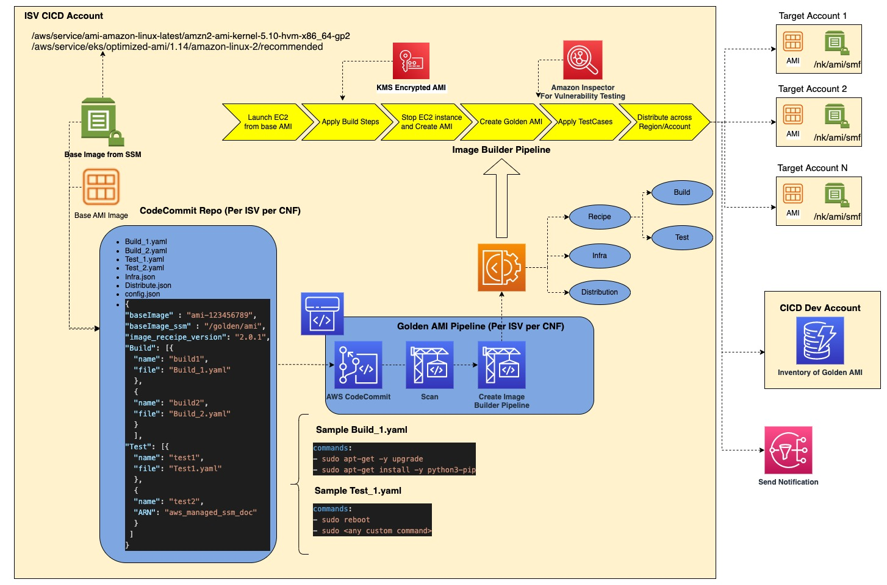
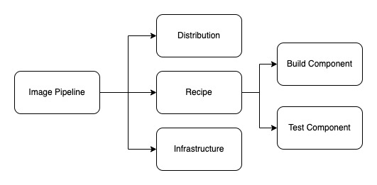

<!-- vscode-markdown-toc -->
# Table of Contents
- [Background](#Background)
    - [test](#Test)
- [Keyfeatures](#keyfeatures)
- [Background](#Background)
- [Background](#Background)


<!-- vscode-markdown-toc-config
	numbering=true
	autoSave=true
	/vscode-markdown-toc-config -->
<!-- /vscode-markdown-toc -->


# Background
As part of Infra deployment pipeline, we have been deploying EKS cluster with Node Group. The launch template of the Auto Scaling Group provides the information about the AMI (Amazon Machine Image) to be used for the worker nodes. At present, each ISV creates their own AMI ( per CNF) using manual process.There is no automated Pipeline to build , test and distribute Golden AMI in target account. 
The following Solution describes how each ISV can create their own Golden AMI Pipeline to Build/Test/Distribute based on the configuration provided by them.

# Target Architecture




# Solution
In this solution, we will be using AWS Ec2 Image Builder service for the heavy lifting work of Building, testing and Distributing the Golden AMI. 
The code repository contains all the configuration files provided the user. These configuration files will define how the AMI will be built, tested and distributed across multiple account/region. CDK application will read configuration file ( the details of the configuration file provided by user is described in Configuration File section) deploy the necessary resources in ISV CICD account. 
On a **high level**, the image builder pipeline consists of the following - 

- Recepi
    -   What Base Image to Use
    -   What are the Build step
    -   What are the Test and validate step
- Infrastructure
    -   What type of EC2 instance to launch to build and test
    -   Which VPC, Subnet and Security Group to Use while launching the instance.
- Distribution
    -   Where to Distribute the AMI after creation - which account/region
    -   What tag will be added in the AMI in the target account 




# <a name='keyfeatures'></a>Key Features 
-   As part of the security best practice, there will be one Customer Manager Keys ( CMK) created per pipeline and the underlying EBS volume of AMI will be encrypted with the same

-   Base image can refer to AWS managed public ssm parameter (for example - /aws/service/eks/optimized-ami/1.14/amazon-linux-2/recommended) that holds the latest Amazon Linux 2 AMI or latest EKS optimized AMI or it can refer any Base AMI ID (ami-0123456789) that is available in the region where the service is being deployed

-   User can bring their own Build and Test steps ( in yaml file) or AWS managed pre-build SSM documentation can also be used.

-   EC2 Inspector (by using AWS Managed SSM Document) can be integrated for Vulnerability scanning. 

-   Once the Golden AMI is distributed , the SSM parameter in target account will be updated in with the new AMI ID . The SSM parameters value in the target account will always contain the latest AMI built through the pipeline.

-   Image Pipeline will send SNS notification for success or failure. Later this can be used to update DynamoDB ( This part is not implemented in the solution)

-   AMI Pipeline creation is configuration driven. CDK application will read the user provided configuration and provision the pipeline. 


# <a name='howtodeploy'></a>How to Deploy


## <a name='prereq'></a>Pre-Requisite


# <a name='sample'></a>Sample Config File

A sample `config.json` file looks like below - 

```
{
    "baseImage": "ami-090fa75af13c156b4",
    "baseImageType": "id",
    "resource_removal_policy": "destroy",
    "ami_component_bucket_name": "golden-ami-component-nk-poc",
    "attr": "nk-poc",
    "instanceProfileName": "Golden_AMI_Instance_Profile_nk-poc",
    "imagePipelineName": "Golden_Image_Pipeline-nk-poc",
    "components_prefix": "components",
    "iamEncryption": true,
    "amitag": {
        "isv_name": "nk",
        "cnf_name": "amf",
        "env": "dev",
        "Name": "golden-ami-nk-amf-dev-{{imagebuilder:buildDate}}",
        "Date_Created": "{{imagebuilder:buildDate}}"
    },
    "tag": {
        "isv_name": "nk",
        "cnf_name": "amf",
        "env": "dev",
        "Name": "golden-ami-nk-amf-dev"
    },
    "image_receipe": {
        "image_receipe_version": "3.1.4",
        "image_receipe_name": "Golden_AMI_Image_Recipe-nk-poc",
        "volume_size": 3072,
        "deleteOnTermination": false,
        "volume_type": "gp2"
    },
    "infrastructure": {
        "name": "Golden_AMI_Instance_Infra-nk-poc",
        "instance_type": ["t2.small"]
    },
    "inspector_validation": true,
    "Inspector_Config": {
        "Build": [
            {
                "name": "inspector_validation",
                "version": "3.0.7",
                "file": "components/inspector.yaml",
                "parameter": [
                    {
                        "name": "version",
                        "value": [
                            "1.0.5"
                        ]
                    },
                    {
                        "name": "high_severity_findings_threshold",
                        "value": [
                            "15"
                        ]
                    },
                    {
                        "name": "ignore_findings",
                        "value": [
                            "yes"
                        ]
                    },
                    {
                        "name": "inspector_finding_script_path",
                        "value": [
                            "golden-ami-component-nk-poc/components/inspector_findings.sh"
                        ]
                    }
                ]
            }
        ]
    },
    "isv_name": "nk",
    "cnf_name": "amf",
    "env": "dev",
    "golden_ami": "true",
    "Component_Config": {
        "Build": [
            {
                "name": "build1",
                "file": "components/build2.yaml",
                "version": "1.0.0"
            },
            {
                "name": "build2",
                "file": "components/build7.yaml",
                "version": "1.0.0"
            },
            {
                "name": "build3",
                "file": "components/build1.yaml",
                "version": "1.0.0",
                "parameter": [
                    {
                        "name": "testparam",
                        "value": [
                            "samplevalue"
                        ]
                    }
                ]
            },
            {
                "name": "test1",
                "file": "components/build2.yaml",
                "version": "1.0.0"
            }
        ],
        "Test": [
            {
                "name": "test2",
                "file": "components/test1.yaml",
                "version": "1.0.0"
            },
            {
                "arn": "arn:aws:imagebuilder:us-east-1:aws:component/reboot-test-linux/1.0.0/1"
            }
        ]
    },
    "Distribution": [
        {
            "region": "us-east-1",
            "accounts": [
                "208665233135"
            ]
        }
    ]
}
```

There are two config file - 

`config.json` - Configuration file that defines all the parameters needed to deploy the AMI Pipeline 

`default_component.json` - Optional component file that contains Build and Test step that can be added by default. The Build Steps added in this file will be executed at first. The Test steps added in this file will be executed last. This is one way to enforce mandatory build and test step. For example, This file can contain mandatory build step such as upgrading all available OS Package and mandatory test step to check if reboot is working after all build is completed. Type of this value is ComponentConfig which is described below

`config.json` file contains the following parameters - 

```
baseImage: string;
baseImageType?: string;
ami_component_bucket_name?: string;
ami_component_bucket_create?: boolean;
ami_component_bucket_version?: boolean;
imagePipelineName: string;
instanceProfileName?: string;
instanceProfileRoleName?: string;
iamEncryption?: boolean;
components_prefix: string;
key_alias?: string;
image_receipe: receipe;
golden_ami?: string;
sns_topic?: string;
attr: string
amitag?: object;
tag?: object;
infrastructure: infrastructure;
inspector_validation?: boolean;
Inspector_Config?: ComponentConfig;
Component_Config: ComponentConfig;
Distribution?: distribution[];
distributionName?: string;
distributionDescription?: string;
resource_removal_policy?: string
```

###  2. <a name='ParameterDetails'></a>Parameter Details

| Parameter Name | Required | Type | example | Default Value | Notes |
| :--------------- |:---------------|:---------------|:---------------|:---------------|:---------------|
| attr | Yes | String | poc | NA | Meaningful String that uniquely identifies the pipeline. This attribute will be appended to all the resource name if not provided |
|baseImage|Yes|String|ami-090fa75af13c156b4 or /golden/ami|NA| baseImage  refer to base AMI ID or SSM parameter that contains AMI ID. Golden AMI will be created based off this base image.|
|baseImageType| No| String | ssm or id | id | baseImageType select ssm, if baseImage contains SSM Parameter, Select id if baseImage contains AMI ID
|resource_removal_policy|No|String | destroy or retain |retain|Image Builder component and recipe removal policy. Based on this value, the older version of image builder of component and receipt will either be deleted or retained.|
|ami_component_bucket_name|No|String|golden-ami-component-nk|golden-ami-component-${attr}|This bucket will contain all the related user defined build and test component. If not specified, Bucket will be created with attribute name|
|ami_component_bucket_create|No|Boolean|true or false | true|If true, ami_component_bucket_name will be created. If selected as false, then ami_component_bucket_name should exists|
|ami_component_bucket_version|No|Boolean|true or false|true|The parameter is used to enable/disable S3 Bucket version
|instanceProfileName|No|String|Golden_AMI_Instance_Profile_nk-amf|Golden_AMI_Instance_Profile-${attr} | Instance Profile
|instanceProfileRoleName|No|String|Golden_Image_Pipeline-nk-amf-role|CDK will create a dynamic name. This role will be attached to the EC2 instance Profile Role|
|imagePipelineName|Yes|String|Golden_Image_Pipeline-nk-amf|NA|The Name of the Image pipeline to be created.|
|components_prefix|Yes|String|golden_ami_amf_components|NA|prefix of the S3 Bucket ami_component_bucket_name where the related component will be deployed and referenced|
|iamEncryption|No|Boolean|true or false|false|If enabled, a new CDK key will be created and underlying EBS volume of the AMI will be encrypted with the same|
|amitag|No|object|example|NA|This tag will be appplied to the distributed AMI in target account/region|
|tag|No|object|example|NA|This tag will be applied to all the resources created by the CDK application|
|image_receipe|Yes|recipe|example|NA|EC2 Builder image recipe|
|infrastructure|yes|infrastructure|example|Ec2 Builder Infrastrure details that will be used to launch EC2 instance|
|inspector_validation|No|Boolean|true or false|false|To add inspector validation step at the end of the build phase. |
|Inspector_Config|No|ComponentConfig|example|Details of the Inspector configuration parameter can be found here.|
|Component_Config|Yes|ComponentConfig|example|NA|Defines the Build and Test Steps|
|Distribution|No|list of distribution|example|NA|The config detail about which target account and region the golden AMI will be distributed|
|distributionName|No|String|Golden_AMI_Distribution-am-amf|Golden_AMI_Distribution-$attr|Distribution settings name|
|distributionDescription|No|String|example|Destribution settings for $'attr'|Description of the distribution settings
|sns_topic|No|String|arn:aws:sns:us-east-1:0123456789:myTopic|NA|Notification will be sent to this SNS Topic, after Image builder pipeline execution is completed.|
|key_alias|No|String|Golden_AMI_key_nk_amf|NA|If not provided, KMS key will be created without alias name
|schedule|No|{ "PipelineExecutionStartCondition" : String, "ScheduleExpression" : String } . For more information, link|{ "scheduleExpression": "cron(0 10 * * ? *)"}|Manual|AMI Pipeline Schedule|


# Parameter Details

## **distribution**

### Type
```
{
  region: string;
  accounts: string[];
}
```
### Details

| Parameter Name | Required | Type | example | Default Value | Notes |
| :--------------- |:---------------|:---------------|:---------------|:---------------|:---------------|
|region|Yes|String|us-west-2|NA|Region name where Golden AMI will be distributed
|accounts|Yes|List of String|["1234556789","987654321"]|NA|Account Name where Golden AMI will be distributed


### Example
```
[
    {
        "region": "us-east-1",
        "accounts": [
            "1234556789",
            "987654321"
        ]
    }
]
```

## **infrastructure**

### Type
```
{
        name: string;
        instance_type?: string[];
        subnet_id?: string;
        security_groups?: string[];
}
```

### Details

| Parameter Name | Required | Type | example | Default Value | Notes |
| :--------------- |:---------------|:---------------|:---------------|:---------------|:---------------|
|name|Yes|String|Golden_AMI_Pipeline_infra_nk_amf|NA|Name of the infrastructure resource created in Image builder service.
|instance_type|No|List of String|["t2.small"]|NA|Instance type to be used for Building Golden AMI
|subnet_id|No|String|"subnet-123456"|NA|If not provided, default VPC and Subnet will be used.
|security_groups|No|List of String|["sg-123456789"]|NA|This is needed if the subnet ID is provided.


### Example 
```
{
	"name": "Golden_AMI_Instance_Infra-nk-poc",
	"instance_type": ["t2.small"]
}
```


## **Component_Config**

### Type
```

{
    Build?: {
      name?: string;
      file?: string;
      version?: string;
      arn?: string;
      parameter?: { name: string; value: string[]
        }[];
    }[];
    Test?: {
      name?: string;
      file?: string;
      version?: string;
      arn?: string;
      parameter?: { name: string; value: string[]
        }[];
    }[];
}
```

### Details

| Parameter Name | Required | Type | example | Default Value | Notes |
| :--------------- |:---------------|:---------------|:---------------|:---------------|:---------------|
|name|Depends, check notes|String|Install_jq|NA|name of the Build/Test component
|file|No ( If arn is mentioned)|golden_ami_amf_components/build1.yaml|NA|user provided component yaml  file path 
|version|Depends, check notes|String|1.0.0|NA|semantic version of the component to be created
arn|No|String|arn:aws:imagebuilder:us-east-1:aws:component/update-linux/1.0.2/1|NA|amazon managed component arn. Make sure this exists in the account/region the pipeline is being deployed( Navigate to image builder console ->component->select amazon owned).Also, if arn is provided, then name, file, version parameter is not required. Check the example|
|parameter|Yes ( if the component is created with non default parameter)|List of { name: string; value: string[] }|example|NA|parameter is needed if the component is created with non default parameter

### Example

```
{
    "Build": [
        {
            "name": "build1",
            "file": "golden_ami_amf_components/build1.yaml",
            "version": "1.0.1"
        },
        {
            "arn": "arn:aws:imagebuilder:us-east-1:aws:component/update-linux/1.0.2/1"
        },
        {
            "name": "build2",
            "file": "golden_ami_amf_components/build2.yaml",
            "version": "1.0.1"
        }
    ],
    "Test": [
        {
            "name": "test2",
            "file": "golden_ami_amf_components/test1.yaml",
            "version": "1.0.1"
        },
        {
            "arn": "arn:aws:imagebuilder:us-east-1:aws:component/reboot-test-linux/1.0.0/1"
        }
    ]
}
```
> U+1F4DD Dorothy :laughing: followed her through many of the beautiful rooms in her castl
Component_Config contains one or more Build/Test components. Each Build or Test contains same parameter as given below - 
Any changes in Component content , requires a new version to be created. All the Components immutable with a specific version. If you change the content of any component , update the version as well. Otherwise, component creation will fail. 


> **Warning**
> This is a warning


:blowfish: for 🐡, :earth_africa: for 🌍, the extremely commonly used :waxing_gibbous_moon: for 🌔, and :dog2: for 🐕 if :dog isn’t good enough for you.

> :warning: **If you are using mobile browser**: Be very careful here!

:warning:
:busstop:

## image_recipe

### Type


{
    image_recipe_version: string; 
    image_recipe_name: string ; 
    volume_size?: number;
    volume_type?: string;
    deleteOnTermination?: boolean
}
Image Recipe is immutable with a specific version. Recipe contains all the components with specific version in a specific order. If the component version changes, or new components added, or components order has been modified, please make sure to update the receipt version. 

### Details

| Parameter Name | Required | Type | example | Default Value | Notes |
| :--------------- |:---------------|:---------------|:---------------|:---------------|:---------------|
|image_recipe_name|Yes|String|Golden_AMI_Pipeline_recipe_nk_amf|NA|Image Recipe Name to be created
|image_recipe_version|Yes|String|1.0.0|NA|Semantic version of the component
|volume_size|No|Number|2048|NA|EBS volume size of the EC2 instance|EBS Volume type of the EC2 instance
|volume_type|No|String|gp2|NA|

### Example

```
{
	"image_recipe_version": "3.1.6",
	"image_recipe_name": "Golden_AMI_Image_Recipe-nk-poc",
	"volume_size": 3072,
	"deleteOnTermination": false,
	"volume_type": "gp2"
}
```


## Inspector_Config - Same as Component Config

| Parameter Name | Required | Type | example | Default Value | Notes |
| :--------------- |:---------------|:---------------|:---------------|:---------------|:---------------|
|version|yes|String|1.0.5|NA|Which version of amazon owned SSM documentation for inspector to be used. you can see the latest version from the Ec2 Image Builder console → Component
|high_severity_findings_threshold|yes|String|15|Maximum number of high severity findings allowed.If the number of high severity findings is more than this number, pipeline will fail
|region|Yes|String|us-west-2|NA|Region where the Inspector will be running ( same region where Image builder service is being deployed)
|ignore_findings|Yes|String|yes|if selected “yes”, Pipeline will continue and ignore inspector assessment result


### Example
```
{
    "Build": [
        {
            "name": "inspector_validation",
            "version": "3.0.9",
            "file": "golden_ami_amf_components/inspector.yaml",
            "parameter": [
                {
                    "name": "version",
                    "value": [
                        "1.0.5"
                    ]
                },
                {
                    "name": "high_severity_findings_threshold",
                    "value": [
                        "15"
                    ]
                },
                {
                    "name": "region",
                    "value": [
                        "us-east-1"
                    ]
                },
                {
                    "name": "ignore_findings",
                    "value": [
                        "yes"
                    ]
                },
                {
                    "name": "inspector_finding_script_path",
                    "value": [
                        "golden-ami-component-nk/golden_ami_amf_components/inspector_findings.sh"
                    ]
                }
            ]
        }
    ]
}
```
 

amitag


{
	"isv_name": "nk",
	"cnf_name": "amf",
	"env": "dev",
	"Name": "golden-ami-nk-amf-dev-{{imagebuilder:buildDate}}",
	"Date_Created": "{{imagebuilder:buildDate}}",
	"golden_ami": "true"
}
 


tag


{
	"isv_name": "nk",
	"cnf_name": "amf",
	"env": "dev",
	"Name": "golden-ami-nk-amf-dev"
}
 

 


infrastructure


{
	"name": "Golden_AMI_Instance_Infra-nk-poc",
	"instance_type": ["t2.small"]
}
 


distribution


[{
	"region": "us-east-1",
	"accounts": [
		"208665233135"
	]
}]
 


component


{
	"Build": [{
			"name": "build1",
			"file": "golden_ami_amf_components/build1.yaml",
			"version": "1.0.1"
		},
		{
           "arn": "arn:aws:imagebuilder:us-east-1:aws:component/update-linux/1.0.2/1"
        },
		{
			"name": "build2",
			"file": "golden_ami_amf_components/build2.yaml",
			"version": "1.0.1"
		}
	],
	"Test": [{
		"name": "test2",
		"file": "golden_ami_amf_components/test1.yaml",
		"version": "1.0.1"
	},
	{
      "arn": "arn:aws:imagebuilder:us-east-1:aws:component/reboot-test-linux/1.0.0/1"
    }
    ]
}
 
# TEST

inspector_config


{
	"Build": [{
		"name": "inspector_validation",
		"version": "3.0.9",
		"file": "golden_ami_amf_components/inspector.yaml",
		"parameter": [{
				"name": "version",
				"value": [
					"1.0.5"
				]
			},
			{
				"name": "high_severity_findings_threshold",
				"value": [
					"15"
				]
			},
			{
				"name": "region",
				"value": [
					"us-east-1"
				]
			},
			{
				"name": "ignore_findings",
				"value": [
					"yes"
				]
			},
			{
				"name": "inspector_finding_script_path",
				"value": [
					"golden-ami-component-nk/golden_ami_amf_components/inspector_findings.sh"
				]
			}
		]
	}]
}

image_recipe


{
	"image_recipe_version": "3.1.6",
	"image_recipe_name": "Golden_AMI_Image_Recipe-nk-poc",
	"volume_size": 3072,
	"deleteOnTermination": false,
	"volume_type": "gp2"
}
 


parameter

 


[{
		"name": "param1",
		"value": [
			"value1"
		]
	},
	{
		"name": "param2",
		"value": [
			"value2"
		]
	}
]


Follow  the below steps to deploy the solution 
 

Prerequisites:

Accounts bootstrapped with cdkv2

Example: cdk bootstrap aws://346687249423/us-west-2 --qualifier dish-cdkv2 --toolkit-stack-name CDKToolkit-cicd-cdkv2

If your bootstrap uses a qualifier, all target accounts must have the same qualifier

CDK 2.33.0 or greater installed locally

IAM Role in target accounts with the following:

Trust relationship to allow sts assume-role from your local aws credentials

Target role needs the ability to assume cdk deploy role. Ex CDK Role: cdk-dish-cdkv2-deploy-role-350335073051-us-east-2

Local credentials 

Ability to assume cdk deploy role in ISV CICD account

Configured with ISV CICD account in aws credentials file under cicd profile

 

Get CICD Dev account’s credential to clone the Base Repo

git clone codecommit::us-west-2://Golden_AMI_Base_Repo

Update config.json and default_component.json accordingly. More information about all the parameters can be found here and here.

Verify prerequisites from above are met.

Update isvAccountId (ISV CICD account) in prereq/bin/config.json 

Update cross_account_deploy_role in prereq/bin/config.json with the role name your local credentials will assume in the target account.

If your bootstrap uses a qualifier, update cdk.json with the qualifier in “context” ex:

    "@aws-cdk/core:bootstrapQualifier": "dish-cdkv2"

Update golden_ami_pipeline package with latest version in the package.json file. For example, 

"golden_ami_pipeline": "1.0.1-rc.30"

Run deploy script

./deploy.sh

Deploy script will do the following:

Authenticate to codeartifact

Install dependencies for prereq stack

Iterate through Distribution in prereq/bin/config.json and deploy stacks to target environments

Install dependencies for pipeline stack

Deploy stack to source environment (ISV CICD account)

How differentComponents are connected in EC2 Image Builder Service


Run the Image Pipeline
Once the CDK application is deployed successfully , navigate to Image Builder Service to verify and check all the following resources created

Recipe

Components

Infrastructure

Distribution

Image Pipelines

 

Select the Image Pipeline and start the pipeline by clicking ‘Run Pipeline’ button as per the below screenshot.


 

The status of the pipeline will change through different phase . 

Building → Testing → Distributing → Integrating → Available


Once the status of the Pipeline execution status is available, click version link to get all the AMI ids ( along with the distributed AMI is different region/account)


